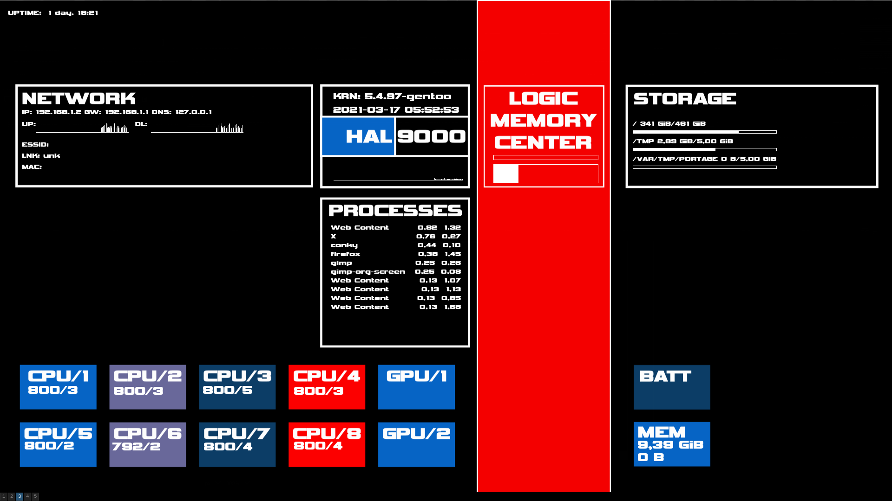

conky-themes
============

# HAL9000

A simple theme inspired by the 2001 computer HAL9000.
Actually, it's just a play with text alignments, nothig serious and it's a work in progress.



To install it:
```bash
git clone https://github.com/dervishe-/conky-themes.git
cd conky-themes/HAL9000
feh --bg-scale ./hal9000_bg.png
cp {.,~}/.conkyrc
sudo mkdir /usr/share/fonts/Vipnagorgialla
sudo cp {.,/usr/share/fonts/Vipnagorgialla}/VIPNAGOR.ttf 
```
I made the background image with inkscape and the svg is also available in the directory.

The font used is `Vipnagorgialla` from laravel fonts which license is in the directory.
